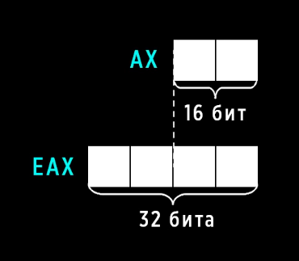
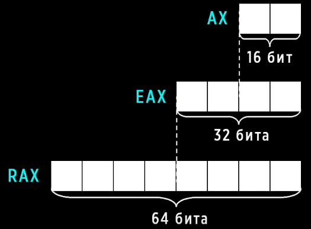
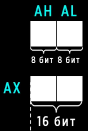

# Main registers

**CX** - счетчик для цикла
**AX** - арифметические операции
**BX**
**DX**

Помимо этого, когда процессоры стали 32-битные, регистры увеличелись, после чего к ним добавился префикс E

То же самое и с 64-битной системой, но к ним уже добавился префикс R

Помимо этого каждый регистр делится на верхний и нижний 

